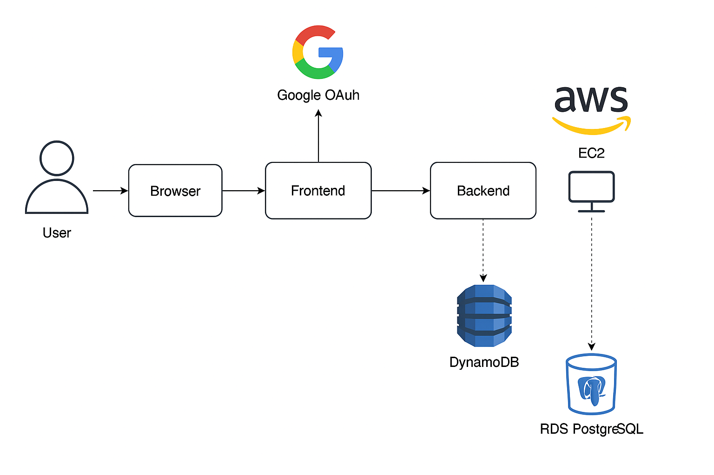

## URL Shortner

For Cloud Computing Assignment we have developed url-shortner application in node.js using express framework, PostgreSql and DynamoDB

## 📌 Prerequisites

- Node.js v22.15 or above
- Nginx installed
- AWS account with:
  - DynamoDB table access
  - IAM role/policy with read/write access attached to EC2
- AWS RDS PostgreSQL database
- Google OAuth credentials
- EC2 instance with an Elastic IP

## 🛠️ Environment Setup

create a **.env** file with following parameters:

```text
    GOOGLE_CLIENT_ID=YOUR_GOOGLE_CLIENT_ID
    GOOGLE_CLIENT_SECRET=YOUR_GOOGLE_OAUTH_SECRET
    GOOGLE_CALLBACK_URL=YOUR_GOOGLE_CALLBACK_URL
    SESSION_SECRET=RANDOMLY_GENERATED_UUID
    PG_CONNECTION_STRING=POSTGRES_CONNECTION_STRING
    AWS_REGION=AWS_REGION
    DYNAMO_TABLE=DYNAMO_DB_TABLE_NAME
```

## Nginx Configuration

Install Nginx and create the following config at:
/etc/nginx/conf.d/node-app.conf

Make Sure the node.js version is above v22.15
install nginx
The nginx config we are using is as follows:

```nginx
    server {
        listen 80;
        server_name your_public_ip http://your_public_ip.nip.io;  # Or use your domain name

        location / {
            proxy_pass http://localhost:8000;
            proxy_http_version 1.1;
            proxy_set_header Upgrade $http_upgrade;
            proxy_set_header Connection 'upgrade';
            proxy_set_header Host $host;
            proxy_cache_bypass $http_upgrade;
        }
    }
```

## Apply Nginx Configuration

Add this configuration to the file: /etc/nginx/conf.d/node-app.conf

```
Run `nginx -t`
Run `systemctl restart nginx`

for example:
- `10.0.0.1.nip.io` maps to `10.0.0.1`
```

Note: We use nip.io to map a public IP to a domain automatically, e.g., 10.0.0.1.nip.io → 10.0.0.1. It's a free DNS mapping service.

## 🚀 Running the Application

- SSH into your EC2 instance
- Install Node.js (v22.15+)
- Clone the repository:

```
git clone https://github.com/amit-bits-git/url-shortner
cd url-shortner
```

- Install dependencies

```
npm install
```

- Start the application:

```
npm start
# or
node server.js
```

- Running Unit Tests

```
npm test
```

## 🗃️ Database Setup

- PostgreSQL (RDS):
- Stores user records (id, email, google_id)
- DynamoDB: Stores shortened URLs with userId and metadata
  Ensure IAM roles for EC2 have read/write permissions to DynamoDB.

## 📌 Deployment Stack

- Frontend: EJS templates with Bootstrap
- Backend: Node.js + Express.js
- Authentication: Google OAuth (Passport.js)
- Databases:
- RDS PostgreSQL (user management)
  - DynamoDB (URL mapping)
- Cloud Infra: AWS EC2, RDS, DynamoDB, Nginx

## Application Flow

- User logs in via Google OAuth.
- The system creates/looks up user in PostgreSQL.
- User submits a long URL.
- App generates a short code and stores it in DynamoDB.
- Redirects based on short URL happen via backend lookup.
- DNS: Dynamic with nip.io

# The Flow is as follows:


